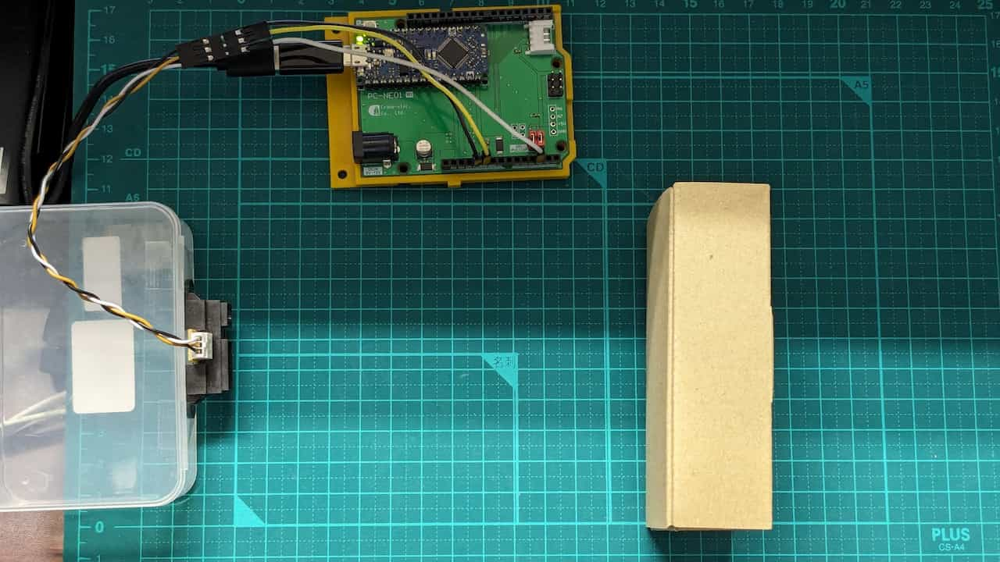

# GP2Y0A21YK_lib
This library provides support for the GP2Y0A21YK infrared proximity sensor with Arduino. It is compatible with Arduino Nano Every and other Arduino boards.

## Installation
Download the ZIP file and install it using the Arduino IDE.

Refer to: https://docs.arduino.cc/software/ide-v1/tutorials/installing-libraries/

## Usage
Run the example sketch located in the `examples/BasicUsage` directory.

### Sample_configuration
- Arduino Nano Every (https://store-usa.arduino.cc/products/arduino-nano-every)
- 赤外線近接センサGP2Y0A21YKと接続ケーブル (https://ssci.to/40)
- PC-NE01 (https://crane-elec.co.jp/products/vol-27/)




## Developers information
When forking and developing this library, you can avoid placing the `.ino` file in the root folder of the project by creating an `arduino.json` file as shown below.

### `.vscode/arduino.json` (VSCode for Windows)
```json
{
    "buildPreferences": [
        [
            "compiler.c.extra_flags",
            "-Wall -Isrc"
        ],
        [
            "compiler.cpp.extra_flags",
            "-Wall -Isrc"
        ]
    ],
    "prebuild":  "xcopy /Y /E /I %CD%\\src %CD%\\examples\\BasicUsage\\src",
    "postbuild": "rmdir /S /Q %CD%\\examples\\BasicUsage\\src",
    "output": ".build",
    "board": "arduino:megaavr:nona4809",
    "sketch": "examples\\BasicUsage\\BasicUsage.ino"
}
```
### Example
When the target sketch is named `sample_demo.ino`, modify the JSON as follows:

```json
...
"prebuild":  "xcopy /Y /E /I %CD%\\src %CD%\\examples\\sample_demo\\src",
"postbuild": "rmdir /S /Q %CD%\\examples\\sample_demo\\src",
...
"sketch": "examples\\sample_demo\\sample_demo.ino"
...
```

